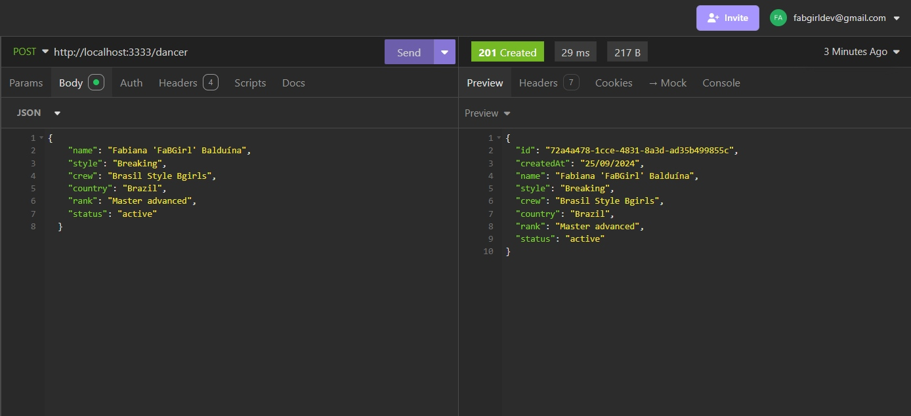
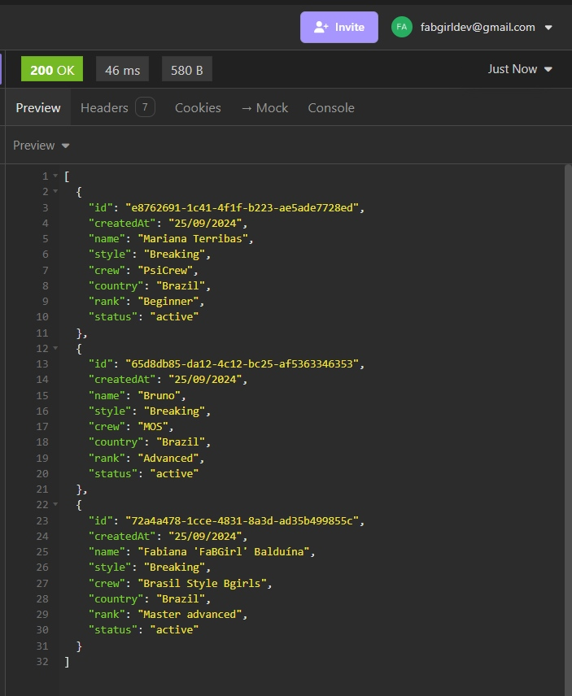
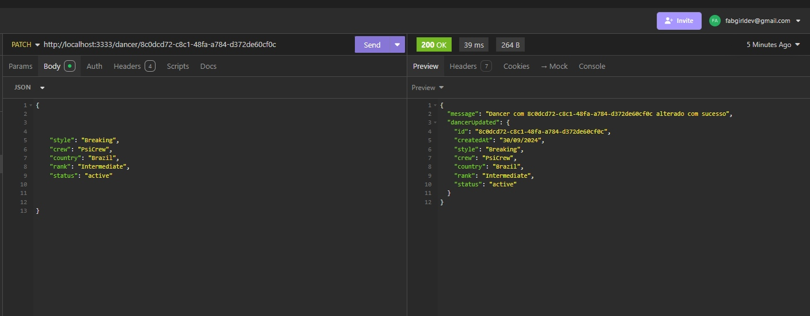
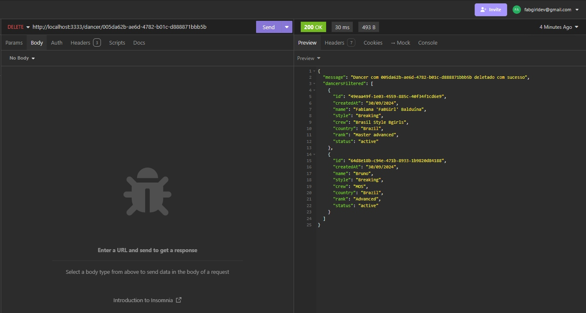
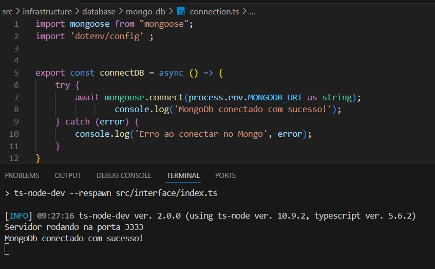

Aqui está o README com as informações substituídas:

# Tarefa Semana 7 - Implementação de Persistência de Dados no Projeto

## Descrição
Nesta semana, o objetivo foi implementar a persistência de dados utilizando MongoDB no projeto anterior. A tarefa consistiu em adaptar o código para salvar e gerenciar os dados no banco de dados MongoDB, garantindo a funcionalidade da API.

### Requisitos da Tarefa:
- Adaptar o projeto anterior (API de livros) para usar MongoDB para a persistência de dados;
- Garantir que a string de conexão do MongoDB **não seja exposta no GitHub**;
- Realizar testes de sucesso no MongoDB e no Insomnia/Postman;
- Incluir prints de sucesso no README.

### Principais Tecnologias Utilizadas: 🚀
1. Node.js;
2. TypeScript;
3. MongoDB;
4. Insomnia para testes das rotas.

### Funcionalidades: 
- CREATE (criar);
- LISTALL (listar todos);
- UPDATE (atualizar);
- DELETE (deletar).

### Testes Realizados no Insomnia e MongoDB: 🧪
Criação de um livro: ⏬

Listagem de todos os livros criados - imagem 1: ⏬

Listagem de todos os livros criados - imagem 2: ⏬

Atualização de livro pelo ID: ⏬

Livro deletado pelo ID: ⏬

### Conexão ao MongoDB:
Conexão com o banco de dados MongoDB realizada com sucesso, mantendo a string de conexão segura e fora do GitHub. ⏬

## O que Estudei Esta Semana:  📚🤓💻
Durante esta semana, na formação Aprofunda PretaLab, estudei como utilizar MongoDB para persistir dados em projetos Node.js. Aprendi a realizar a integração de forma segura, garantindo a modularidade e escalabilidade do código. Além disso, revisei testes unitários e continuei praticando os princípios da Arquitetura Limpa para organizar o código de forma eficiente.